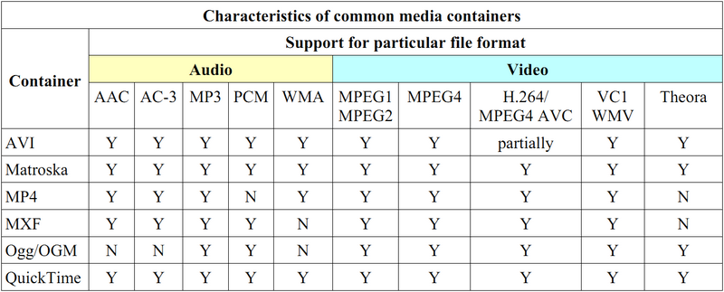

# 压制工具

请尽量在渲染输出时即达到上传要求，避免二压导致画质损失. 具体参数要求见[工作流程-压制](../wf/Encode.md)。

可采用以下压制工具进行：

- [小丸压制工具原版](https://dl.hdslb.com/video-press/xiaowantoolsrev194.zip)

- [小丸压制工具Bilibili定制版](https://dl.hdslb.com/video-press/BiliBiliEncoder.zip)

- [MeGUI](https://sourceforge.net/projects/megui/)

由于上述工具都是基于FFmpeg开发的，因此下面首先介绍一下手动使用FFmpeg的相关知识；之后，将会介绍MeGUI的使用方法。由于小丸压制工具过于简单，在此不做介绍。

## FFmpeg入门

### 封装和编码



### 命令格式

```
ffmpeg -i [输入文件名] [参数选项] -f [格式] [输出文件]
```

### 样例

| ffmpeg -i | [输入文件] | [参数选项] | -f | [格式] | [输出文件] |
|:---------:|:----------:|:---------:|:--:|:-----:|:---------:|
| ffmpeg -i | a.flv | -c:a copy -c:v copy | -f | mp4 | a.mp4|

?> `-c:a copy`表示audio编码不变，直接复制过去(copy)；`-c:v copy`同理。

```bash
ffmpeg -i a.mp4 -i a.ass -c:a copy -vf ass=a.ass -f mp4 b.mp4
```

上述命令将视频文件a.mp4和字幕文件a.ass压制在一起，输出b.mp4。

### 参数说明

`-c:a` 同 `-acodec`，用于指定音频编码，`copy`原样拷贝、`aac`aac编码等等

`-c:v` 同 `-vcodec`，用于指定视频编码，`copy`原样拷贝、`libx264`h264编码等等

`-vn` 舍弃视频

`-an` 舍弃音频

`-y` 覆盖已有文件

`-r` 指定输出视频帧率

`-b` 设定输出码率， `-b:v`设置视频码率，`-b:a`设置音频码率

`-crf` 设定crf，默认值为23，详情见[相关知识-视频压制](../know/encode)

`-preset` 编码预设，选项有`ultrafast superfast veryfast faster fast medium slow slower veryslow placebo`，越慢视频输出质量越高，但是所需时间大幅增加

FFmpeg 不仅可以用于音视频编解码，还可以用于视频画面截取甚至视频制作生成，更多的说明请见[官方文档](http://ffmpeg.org/ffmpeg.html)。

## MeGUI入门

- [猴子也能学会的AVS+MEGUI压制教程](https://bbs.nga.cn/read.php?tid=5640265)

!> 如果轴man在制作字幕时使用`VSFilterMod.dll`来制作特效，那么压制时也要使用`VSFilterMod.dll`，否则会出现特效缺失或是样式错误。