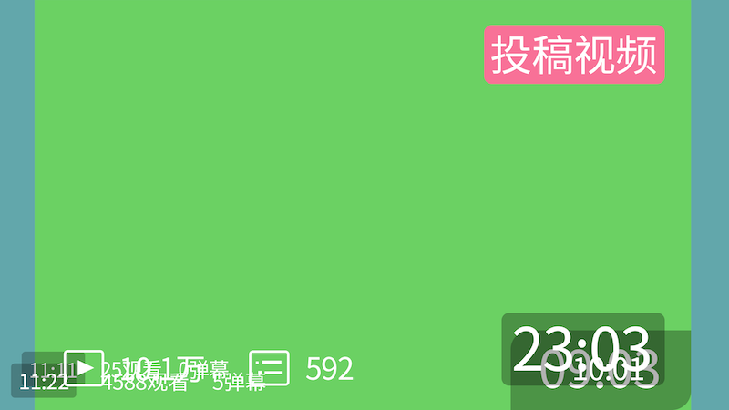

# 美工

## 主要工作

提供视频所需的相关素材，以及视频封面的制作。

## 素材文件

- [いらすとや](https://www.irasutoya.com/)

- [JoiGroupCloud](https://pan.joi-club.cn)的`/公用素材`目录（账号密码见**二创群公告**）

?> 其中`JOI绿幕-表情.mp4`文件为阿轴所分享的表情展示绿幕视频，请自行截取合适的表情用于封面制作。

- 其它免费素材网站

## 注意事项

- 可以分享使用的图片素材请命名好后上传到`/公用素材`目录下。

- 封面大小最小为`960x600`，最大为`1728x1080`，比例为16:10。

?> B站官方给出的要求是：格式jpeg、png，文件大小≤5MB，建议尺寸 ≥ 1146x717，最低尺寸 ≥ 960x600。

- 封面制作修改完成后，请导出为`JPG/PNG`文件，命名为项目名后上传到项目文件夹下。

- 封面制作请尽可能保留`PSD`文档，并上传到其项目文件夹下，文件名为项目名，便于修改以及素材的重复利用。

- 如果有兴趣，可以参考下图避免封面的关键信息被遮挡，`/公用素材/B站遮挡详情.psd`为源文件。(来源自[【PS教程】运营必备！封面图如何适配全平台尺寸？（doyoudo）](https://www.bilibili.com/video/BV1DZ4y1W7Pc))

